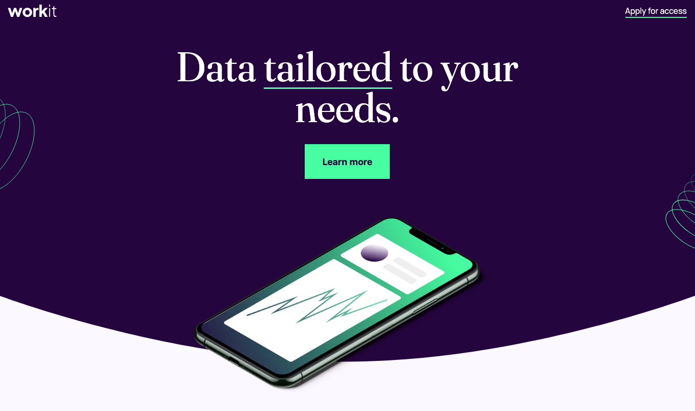

# Frontend Mentor - Workit landing page solution

This is a solution to the [Workit landing page challenge on Frontend Mentor](https://www.frontendmentor.io/challenges/workit-landing-page-2fYnyle5lu). Frontend Mentor challenges help you improve your coding skills by building realistic projects. 

## Table of contents

- [Frontend Mentor - Workit landing page solution](#frontend-mentor---workit-landing-page-solution)
  - [Table of contents](#table-of-contents)
  - [Overview](#overview)
    - [The challenge](#the-challenge)
    - [Screenshot](#screenshot)
    - [Links](#links)
  - [My process](#my-process)
    - [Built with](#built-with)
    - [Useful resources](#useful-resources)

## Overview

### The challenge

Users should be able to:

- View the optimal layout for the interface depending on their device's screen size ✅
- See hover and focus states for all interactive elements on the page ✅

### Screenshot

### Links

- Solution URL: [Frontend Mentor solution](https://github.com/arne-witteler/workit-landing-page)
- Live Site URL: [Live demo](https://workit-landing-page-iota.vercel.app)

## My process

### Built with

- Semantic HTML5 markup
- CSS custom properties
- Flexbox
- Mobile-first workflow

### Useful resources

- [SVG Backgrounds](https://www.svgbackgrounds.com/elements/svg-shape-dividers/) - I used it for the curved bottoms for each section.

